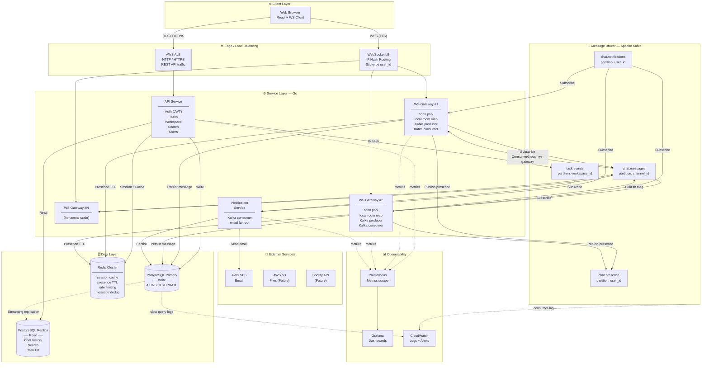
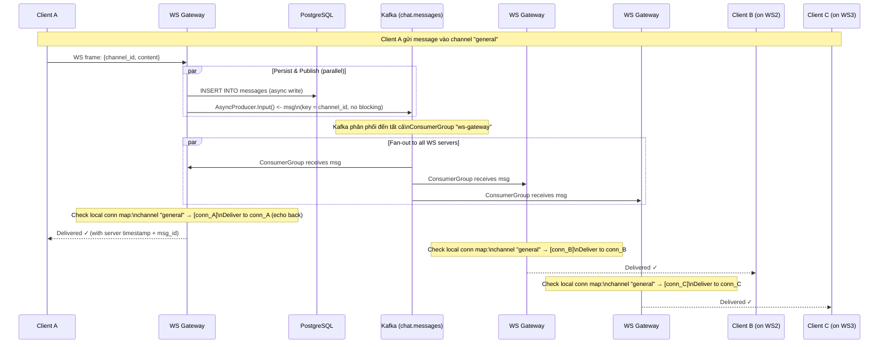
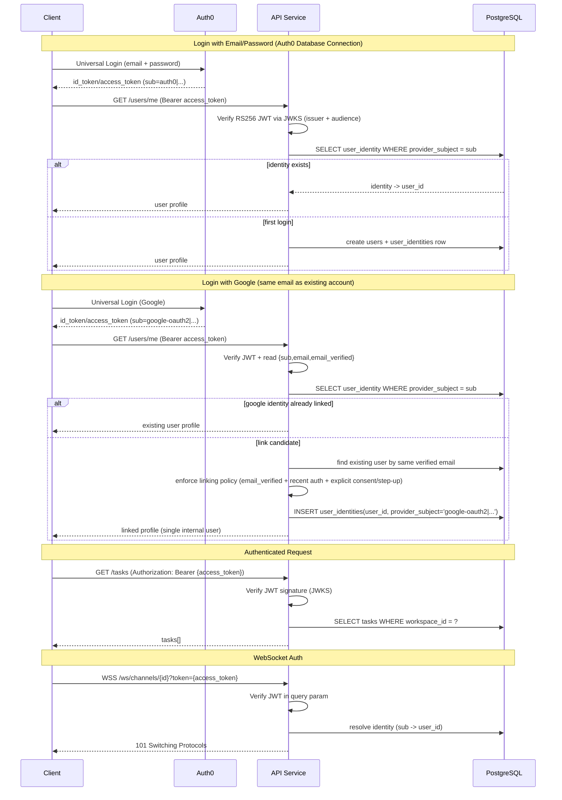
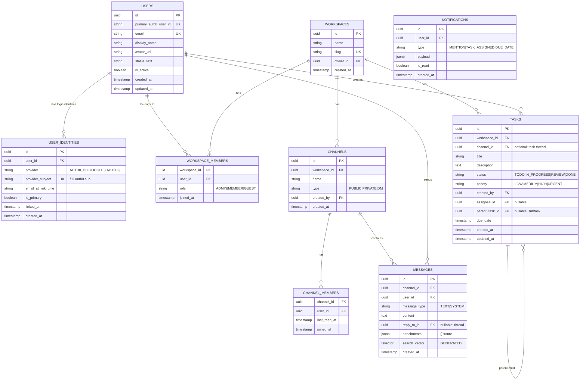

# System Architecture — KashFlow
> Version: 1.0 | Date: 2026-04-25 | Scale target: 1M concurrent users

---

## PHẦN 1 — PHÂN TÍCH RỦI RO LỚN NHẤT

### Rủi ro #1: `BroadcastToRoom` là in-memory — hệ thống KHÔNG thể scale ngang

Đây là rủi ro lớn nhất, không phải vì khó, mà vì **nó ẩn trong code hiện tại và sẽ chỉ lộ ra khi deploy nhiều hơn 1 instance**.

**Vấn đề cụ thể trong code hiện tại:**

```
chat_handler.go → service.BroadcastToRoom(taskID, msg)
                       ↓
               In-memory room map
               [taskID] → [conn1, conn2, conn3]
```

Khi chạy 1 instance: hoạt động bình thường.

Khi chạy 2+ WS instances (bắt buộc để đạt 1M users):

```
Client A → WS Server #1 (room map: [conn_A])
Client B → WS Server #2 (room map: [conn_B])

Client A gửi tin nhắn →
  WS Server #1 broadcast → chỉ Client A nhận được
  WS Server #2 KHÔNG biết → Client B KHÔNG nhận được tin nhắn
```

**3 vấn đề phụ đi kèm:**

| Vấn đề | Vị trí trong code | Hậu quả |
|---|---|---|
| `sarama.SyncProducer` | `pkg/kafka/kafka.go:23` | Block goroutine mỗi lần publish → bottleneck nặng ở high load |
| `sarama.Consumer` thay vì `ConsumerGroup` | `pkg/kafka/kafka.go:36` | Kafka partitions không được chia đều giữa các WS instances → một instance xử lý tất cả |
| `task` = `room` conflation | schema, `chat_handler.go:64` | Không có channel độc lập (general, random) ngoài task → giới hạn product |

---

## PHẦN 2 — HAI PHƯƠNG ÁN GIẢM THIỂU RỦI RO

---

### PHƯƠNG ÁN A: Technical Spike (PoC 5 ngày)

**Ý tưởng**: Trước khi viết production code, bỏ ra 5 ngày xây một **throwaway prototype** để validate toàn bộ critical path.

**Những gì cần validate trong PoC:**

```
[Client x 10,000] → WS Server #1 → Kafka AsyncProducer
                                          ↓
                                    chat.messages topic
                                    (partition by channel_id)
                                          ↓
                         ┌────────────────┴────────────────┐
                    WS Server #1                      WS Server #2
                  ConsumerGroup #A                ConsumerGroup #A
                  (check local map)             (check local map)
                         ↓                               ↓
              Deliver to connected clients    Deliver to connected clients
```

**Metrics cần đo:**
- RAM per WebSocket connection (target: < 10KB/conn → 10GB cho 1M)
- Goroutine count per 1K connections
- Message end-to-end latency: Client A → Kafka → Client B (target: < 100ms)
- Kafka consumer lag khi tải cao

**Pros:**
- Kill unknown unknowns **trước khi** viết 27 SP production code
- 5 ngày đầu tư tránh được 2-3 tuần rewrite sau
- Biết chính xác điểm bottleneck là ở đâu

**Cons:**
- Code throwaway, không dùng được cho production
- 5 ngày "không tiến" về feature

**Khi nào nên chọn A**: Nếu anh chưa tự tin về WebSocket at scale trong Go và muốn học bằng cách thử nghiệm thật sự.

---

### PHƯƠNG ÁN B: Incremental Load Gate (tích hợp vào sprint)

**Ý tưởng**: Không làm throwaway. Thay vào đó, **fix 3 vấn đề kỹ thuật ngay trong Sprint 3**, rồi thêm load test checkpoint vào cuối mỗi sprint.

**Các thay đổi cần làm ngay trong Sprint 3:**

```
THAY ĐỔI 1: SyncProducer → AsyncProducer
pkg/kafka/kafka.go

THAY ĐỔI 2: Consumer → ConsumerGroup
pkg/kafka/kafka.go
→ Mỗi WS instance = 1 consumer trong group "ws-gateway"
→ Kafka tự động phân chia partitions

THAY ĐỔI 3: BroadcastToRoom → Publish to Kafka
chat_handler.go / chat_service.go
→ Nhận message từ client → publish Kafka
→ Kafka consumer nhận lại → check local conn map → deliver
```

**Load test gates theo sprint:**

| Sprint | Load Target | Metric cần pass |
|---|---|---|
| Sprint 3 | 1.000 connections | Latency < 50ms, 0 message loss |
| Sprint 5 | 10.000 connections | Latency < 80ms, Memory < 500MB/instance |
| Sprint 7 | 100.000 connections | Latency < 100ms, Kafka lag < 1s |
| Sprint 9 | 1.000.000 connections | Latency < 150ms, System stable 5 phút |

**Pros:**
- Không mất time cho throwaway code
- Architecture vừa xây vừa validate liên tục
- Phát hiện vấn đề sớm nhưng vẫn tiến về feature

**Cons:**
- Nếu design WebSocket + Kafka sai ở Sprint 3, phải refactor trong lúc đang build features
- Không có "safe playground" để thử nghiệm

**Khi nào nên chọn B**: Nếu anh đã có hình dung rõ về kiến trúc Kafka fan-out và muốn tiến nhanh.

---

### KHUYẾN NGHỊ CỦA TÔI

**Chọn Option A (Spike 5 ngày)**, vì:

1. WebSocket ở quy mô 1M connections là thách thức mà rất ít developer đã làm — không nên underestimate
2. 5 ngày bây giờ rẻ hơn 3 tuần rewrite ở Sprint 6 khi đã có 40+ SP code trên đầu
3. PoC sẽ cho anh **con số thật** để tính toán infrastructure cost (RAM, instance count) — thứ bạn cần để deploy lên AWS

---

## PHẦN 3 — SYSTEM ARCHITECTURE DIAGRAM

### Diagram 1: Tổng quan hệ thống (System Overview)



---

### Diagram 2: WebSocket Message Fan-out Flow (Critical Path)

> Đây là luồng quan trọng nhất — giải thích cách 1M users nhận được message cùng lúc.



---

### Diagram 3: Authentication Flow



---

### Diagram 4: Data Schema — Identity Linking Ready

> Auth0 là nguồn identity duy nhất. App DB không lưu password hash.  
> Để hỗ trợ "đăng ký email/password trước, login Google sau" cần bảng `user_identities`.



### Linking Policy (Bắt buộc)

1. Không auto-link nếu `email_verified = false`.
2. Không link chỉ dựa vào email; cần bước xác nhận từ user (explicit consent) hoặc step-up auth.
3. `provider_subject` là duy nhất toàn hệ thống.
4. Mỗi login đều resolve theo `provider_subject` trước, chỉ fallback email khi chưa có identity row.
5. Sau khi link thành công, mọi provider của user phải map về cùng một `users.id`.

---

## PHẦN 4 — REDIS KEY DESIGN

> Redis là lớp "fast state" — mọi thứ cần đọc/ghi nhanh mà không cần persist lâu dài.

| Key Pattern | Value | TTL | Mục đích |
|---|---|---|---|
| `idmap:{provider_subject}` | `user_id` | 1 giờ | Cache mapping `sub` → internal user to giảm DB read |
| `presence:{user_id}` | `1` | 30 giây | Online/offline status |
| `ratelimit:{user_id}:{endpoint}` | counter | 1 phút | Rate limiting sliding window |
| `dedup:{message_id}` | `1` | 5 phút | Tránh Kafka at-least-once duplicate |
| `channel:unread:{user_id}:{channel_id}` | count | No TTL | Unread message counter |

---

## PHẦN 5 — KAFKA TOPIC DESIGN

| Topic | Partition Key | Retention | Consumer Groups |
|---|---|---|---|
| `chat.messages` | `channel_id` | 7 ngày | `ws-gateway` (all WS instances) |
| `chat.presence` | `user_id` | 1 phút | `ws-gateway` |
| `chat.notifications` | `user_id` | 24 giờ | `ws-gateway`, `notification-service` |
| `task.events` | `workspace_id` | 7 ngày | `notification-service` |

**Lý do partition by `channel_id` cho `chat.messages`:**
- Messages trong cùng channel đảm bảo ordering (FIFO)
- Kafka partition = đơn vị parallelism → nhiều channel = nhiều partitions xử lý song song
- Số partitions recommend: `expected_peak_channels_active_concurrent × 2` (bắt đầu với 32)

---

## PHẦN 6 — INFRASTRUCTURE (Local → AWS)

### Local Development (hiện tại)
```
docker-compose.yaml
├── go-api          (port 8080)
├── postgres        (port 5432)
├── redis           (port 6379)
├── kafka           (port 9092)
└── zookeeper       (port 2181)
```

### AWS Production Target
```
AWS VPC (private subnets)
├── ECS Fargate
│   ├── api-service          (2 tasks minimum)
│   ├── ws-gateway           (N tasks, scale by CPU/conn count)
│   └── notification-service (1-2 tasks)
├── RDS PostgreSQL           (db.r6g.large + 1 read replica)
├── ElastiCache Redis        (cache.r6g.large, cluster mode)
├── MSK (Managed Kafka)      (kafka.m5.large × 3 brokers)
└── ALB                      (HTTP + WebSocket listeners)
```

---

## PHẦN 7 — ĐIỂM CẦN LÀM NGAY (Technical Debt trong code hiện tại)

> Những vấn đề này cần fix TRƯỚC khi build thêm feature, không phải sau.

| # | Vấn đề | File | Fix cần làm |
|---|---|---|---|
| 1 | `SyncProducer` block goroutine | `pkg/kafka/kafka.go:23` | Chuyển sang `AsyncProducer` |
| 2 | `sarama.Consumer` thay vì `ConsumerGroup` | `pkg/kafka/kafka.go:36` | Dùng `sarama.NewConsumerGroup` |
| 3 | `BroadcastToRoom` in-memory | `chat_service.go` | Route qua Kafka fan-out |
| 4 | Identity model chưa hỗ trợ account linking | `users` schema + auth service | Thêm `user_identities`, policy link an toàn theo email verified |
| 5 | Thiếu `workspace` + `channel` concept | DB schema | Viết migration mới trước Sprint 2 |
| 6 | `task` conflated với `chat room` | Toàn bộ codebase | Tách `channel` thành entity riêng |
